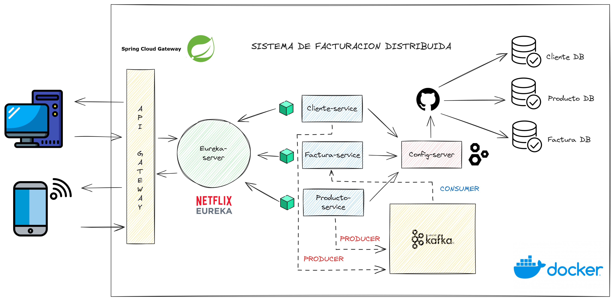

# Sistema de Facturación con Microservicios

Este proyecto es un sistema de facturación desarrollado con **Spring Boot**, estructurado bajo una **arquitectura de microservicios**. La aplicación cuenta con microservicios independientes para **Cliente**, **Factura** y **Producto**, permitiendo escalabilidad y mantenimiento modular.

---

## Arquitectura del Proyecto

- Microservicios independientes:
    - **Cliente**
    - **Factura**
    - **Producto**

- **Patrones y Tecnologías aplicadas**:
    - **API Gateway**: Spring Cloud Gateway, para enrutar solicitudes a los microservicios.
    - **Service Discovery**: Netflix Eureka (Eureka Server), para registrar y descubrir servicios automáticamente.
    - **Mensajería asíncrona**: Apache Kafka
        - Producer: Cliente y Producto
        - Consumer: Factura
    - **Bases de datos PostgreSQL**:
        - Cliente DB
        - Factura DB
        - Producto DB
    - **Gestión de configuraciones**: Configuraciones centralizadas del servicio en GitHub.
    - **Contenerización**: Docker para empaquetar y desplegar los microservicios de manera aislada.

---

## Requisitos

- Java 17+
- Spring Boot 3.x
- PostgreSQL 14+
- Docker y Docker Compose
- Apache Kafka 3.x
- Git

---

